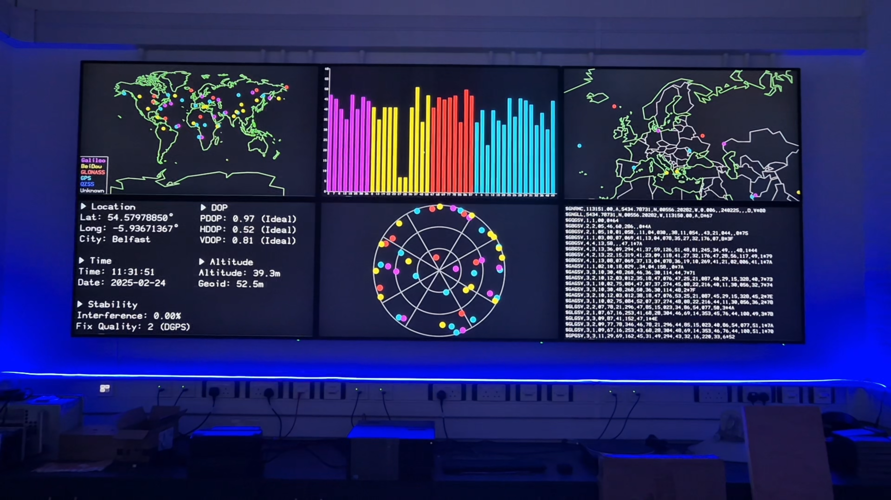

# GNSS and Precision Time War Room

A project for displaying Global Navigation Satellite System (GNSS) and precision time data.

The whole system will be covered in further detail in the dissertation.

_Running at the Cyber Physical Systems Lab, Queen's University Belfast_

Video of it in action: <https://www.youtube.com/watch?v=4Qw9tWjHihw>

## Setup

Create a virtual environment: `python -m venv .venv` and activate it.

On Linux: `source .venv/bin/activate`
On Windows: `.venv\Scripts\Activate.ps1`

Install dependencies: `pip install -r requirements.txt`  
Copy `config.example.json5` to `config.json5`, then edit as needed.

### If running MQTT broker locally

Start up the container for the MQTT broker: `podman compose up` (Note: docker will also work)

Now, while the container is running, set a password for publishing to the broker: `podman exec mosquitto mosquitto_passwd -b /etc/mosquitto/passwd gnssreceiver <password>`, replacing `<password>` with a password of your choosing (e.g. "Joshua"). Create a file called `.env` in the root folder of the project, with the contents `GNSS_PUBLISHER_PASSWORD=<password>`.

Finally, restart the broker container for it to read the new password.

### If running MQTT on a remote server

Edit `config.json5` and set `mqttHost` to the hostname of the remote server. You will also need to set the `GNSS_PUBLISHER_PASSWORD` environment variable to the password for the `gnssreceiver` user. (See example configuration in the `./mosquitto` folder)

## Running

### Desktop UI

To display the main PyQt GUI, run `python main.py`. To stop it, either close all windows manually, or press <key>Ctrl+c</key> on the terminal you ran it from.

On all windows, <key>F</key> toggles fullscreen.

Map controls:

- WASD: move map (hold shift to move faster)
- Q: zoom in
- E: zoom out
- T: Toggle satellite trails (may not be visible if application just started)
- Z: rotate between scale methods (constant scale, scale to fit width, scale to fit height, fit to window)
- X: toggle country borders
- C: toggle cities
- Arrow keys: move network key
- K: toggle network key key

SNR Chart:

- S: toggle sorting between by network, by signal to noise ratio, and by angle of elevation
- U: toggle displaying untracked satellites (those not used to obtain positioning data)

Globe:

- R: toggle rotation
- Scroll: zoom in/out
- Click: pan camera

### Web UI

To run the web frontend: `sh webStart.sh` (will default to port 2024)

## Sending data

To send live data to the system, modify `config.json5` to set `gnssSerialPort` to the correct serial port, and run `python -m receiver.publishLive`.

For prerecorded samples that can be replayed to test the system at any time using `python -m receiver.publishLog`, see https://github.com/autumn-mck/gnss-nmea-samples

This can be set to publish faster than real-time, i.e. using `GNSS_SPEED_MULT=20 python -m receiver.publishLog`

This project is licensed under GPLv3, with some exceptions:

- the files in the `font` directory are licenced under the beer-ware licence
- the "1981" map from Project Linework by Daniel Huffman is public domain
- the "polar grid" is based on https://commons.wikimedia.org/wiki/File:Circle_r%3D1.svg by Pbrks, licensed under CC BY-SA 3.0
