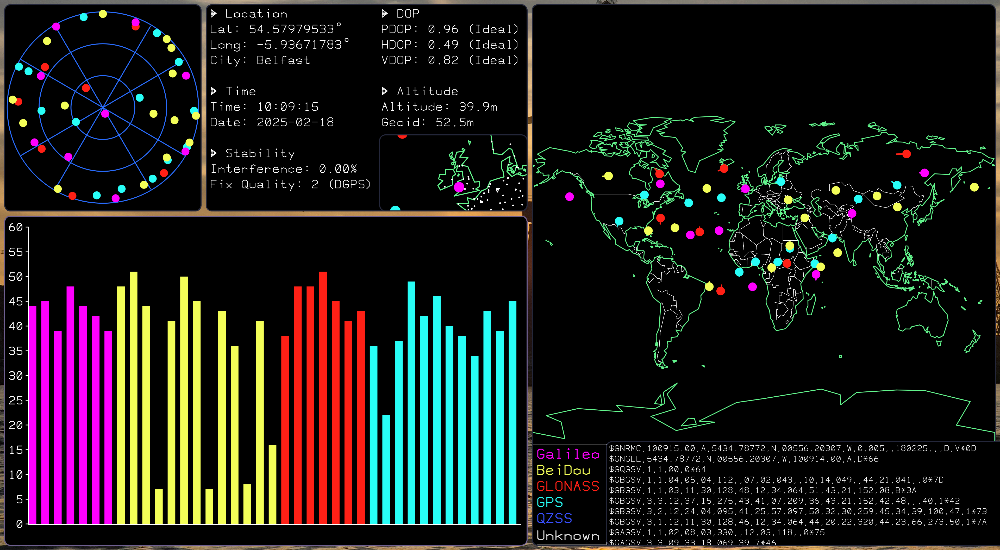
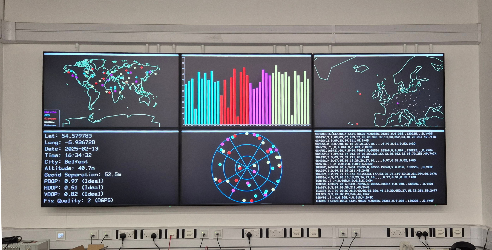
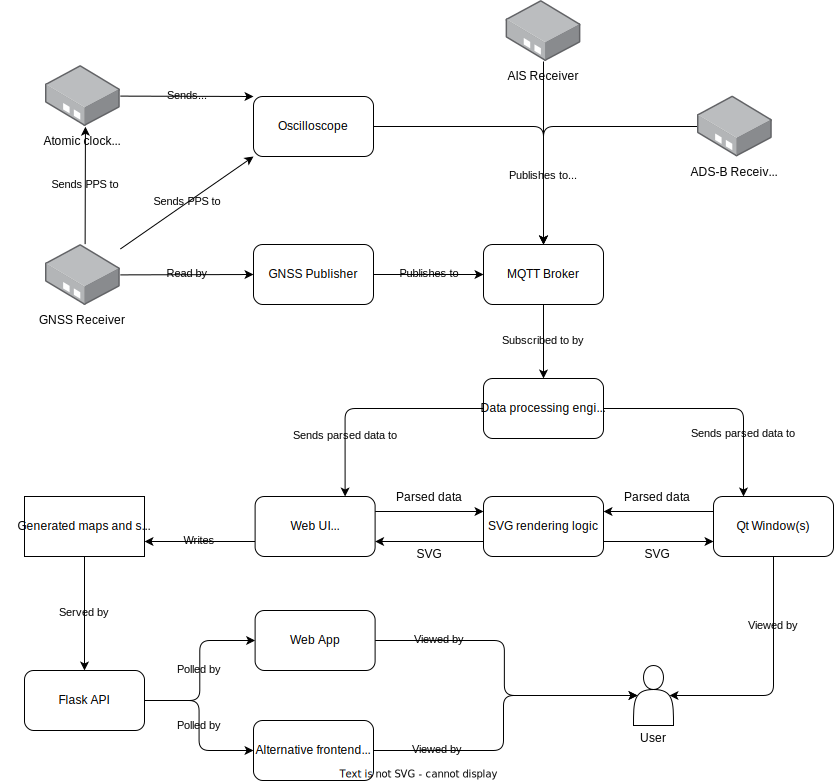

# GNSS and Precision Time War Room

A project for displaying Global Navigation Satellite System (GNSS) and precision time data.

The whole system will be covered in further detail in the dissertation.

_Running at the Cyber Physical Systems Lab, Queen's University Belfast_

## Setup

Create a virtual environment: `python -m venv .venv` and activate it: `source .venv/bin/activate`

Install dependencies: `pip install -r requirements.txt`

### If running MQTT locally

Start up the container for the MQTT broker: `podman compose up`

Now, while the container is running, set a password for publishing to the broker: `podman exec mosquitto mosquitto_passwd -b /etc/mosquitto/passwd gnssreceiver <password>`, replacing `<password>` with a password of your choosing, e.g. "Joshua". Create a file called `.env`, with the contents `GNSS_PUBLISHER_PASSWORD=<password>`.

Finally, restart the broker container for it to read the new password.

Note: The above steps should also work using docker, although this has not yet been tested.

### If running MQTT on a remote server

Edit `config.json5` and set `mqttHost` to the hostname of the remote server. You will also need to set the `GNSS_PUBLISHER_PASSWORD` environment variable to the password for the `gnssreceiver` user. (See example configuration in the `./mosquitto` folder)

## Running

Edit `config.pyjson5` as needed. To display the main PyQt GUI: `python main.py`

Map controls:

- WASD: move map
- Q: zoom in
- E: zoom out
- Z: rotate between scale methods (constant scale, scale to fit width, scale to fit height, fit to window)
- X: toggle country borders
- C: toggle cities
- Arrow keys: move key
- K: toggle key

To run the web frontend: `sh webStart.sh` (will default to port 2024)

## Sending data

To send live data to the system, modify `config.json5` to set `gnssSerialPort` to the correct serial port, and run `python -m receiver.publishLive`.

For prerecorded samples that can be replayed to test the system at any time using `python -m receiver.publishLog`, see https://github.com/autumn-mck/gnss-nmea-samples

